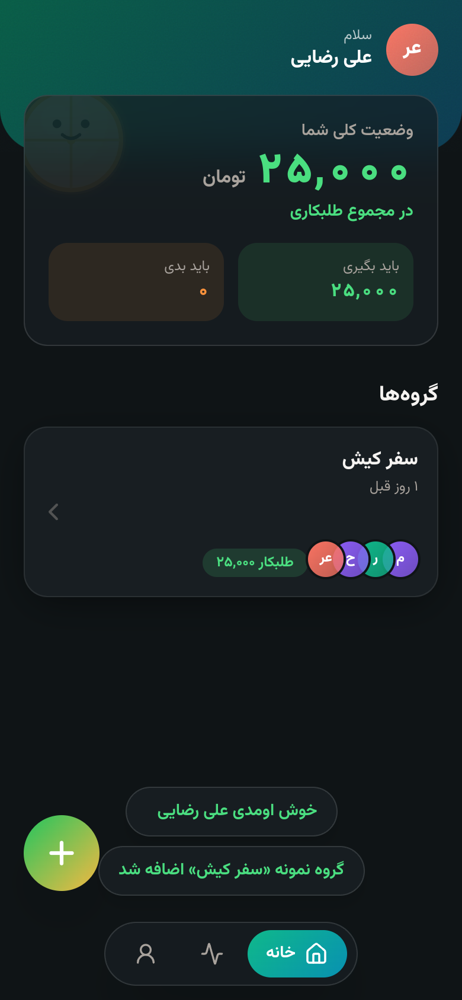
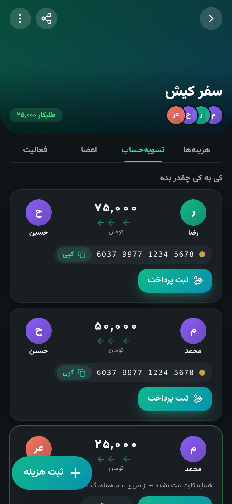
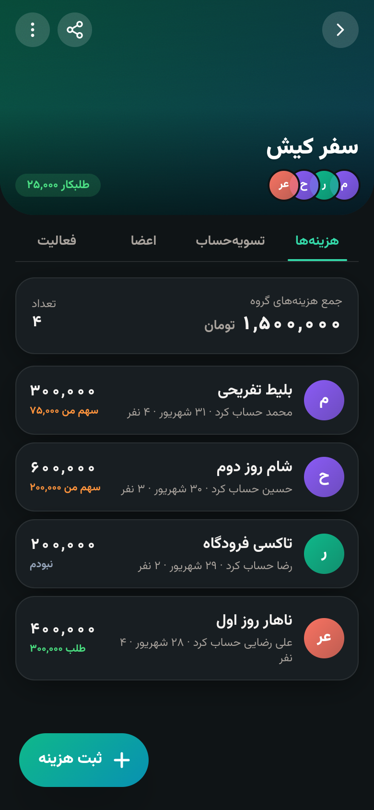
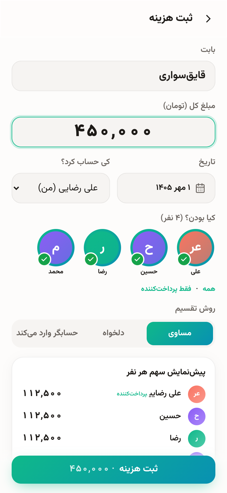

<div align="center">

📱 **دانلود APK اندروید:** https://github.com/soheilxcoder/dong/releases/tag/apk-latest  
🌐 **نسخه وب:** https://soheilxcoder.github.io/dong/

هر push روی شاخه‌ها، workflow `Android APK` را اجرا می‌کند و فایل‌های `.apk` و `.aab` را در release با تگ `apk-latest` منتشر می‌کند. برای امضای Play Store، secrets زیر را در ریپو تعریف کنید: `ANDROID_KEYSTORE_B64`, `ANDROID_KEYSTORE_PASSWORD`, `ANDROID_KEY_ALIAS`, `ANDROID_KEY_PASSWORD`.
  
  <h1>دُنگ — Dong</h1>
  <p><b>حساب‌کتاب دنگی، بدون دعوا.</b><br/>اپلیکیشن تقسیم هزینه گروهی برای سفر، خونه مشترک، دورهمی‌ها.</p>
  <p>
    <a href="https://soheilxcoder.github.io/dong/">🌐 دموی زنده (PWA)</a> ·
    <a href="docs-src/PLAY_STORE.md">📱 راهنمای انتشار در Play Store</a> ·
    <a href="docs-src/GITHUB_PAGES.md">🚀 راهنمای GitHub Pages</a> ·
    <a href="ROADMAP.md">🗺️ نقشه راه</a>
  </p>
</div>

<p align="center">
     
</p>

## چی کار می‌کنه؟
در یک گروه، هر بار یکی حساب می‌کنه و فقط بعضی‌ها حاضرن. دُنگ همه این رفت‌وبرگشت‌ها رو در طول زمان جمع می‌زنه و آخرش با **کمترین تعداد تراکنش** می‌گه *کی دقیقاً به کی چقدر باید بده*.

- ✅ موتور محاسباتی دقیق با اعداد صحیح (بدون خطای اعشار) + الگوریتم کمینه‌سازی تراکنش (Greedy)
- ✅ شرکت‌کننده‌های متفاوت در هر هزینه، تقسیم مساوی/دلخواه/توسط حسابگر، پیش‌نمایش زنده سهم‌ها
- ✅ ثبت پرداخت با رسید، پرداخت جزئی، تأیید/رد توسط طلبکار، یادآوری
- ✅ شماره کارت بانکی با کپی یک‌ضربه‌ای + تشخیص بانک از روی شماره کارت
- ✅ دعوت با لینک و QR، تاریخچه فعالیت گروه، حالت تاریک کامل، تاریخ شمسی، RTL
- ✅ **آفلاین کامل** (PWA / IndexedDB) — و بک‌اند اختیاری برای همگام‌سازی چند دستگاه

## ساختار ریپو
```
apps/web        PWA (React + Vite + Tailwind + Framer Motion) + پروژه اندروید (Capacitor)
apps/api        بک‌اند اختیاری (Express + Prisma + PostgreSQL) — همان API سند فنی
packages/core   ⭐ موتور بدهی (Debt Engine) + تست‌ها — مشترک بین وب و سرور
design/         لوگو، آیکون‌های Play، فیچر گرافیک، اسکرین‌شات‌های فروشگاه
docs/           اسناد محصول + راهنماهای انتشار
```

## اجرا
```bash
npm install
npm test            # تست‌های موتور محاسباتی (سناریوی «سفر کیش» و …)
npm run dev         # http://localhost:5173
npm run build       # خروجی apps/web/dist
```

### سرور اختصاصی (اختیاری) — وب‌اپ + API + SQLite در یک برنامه
```bash
cp .env.example .env && nano .env      # JWT_SECRET و PUBLIC_APP_URL
docker compose up -d --build           # http://IP:4000
# یا بدون Docker (Node ≥ 22.13):
npm ci && npm run build:selfhost && npm start
```
راهنمای کامل مبتدی‌پسند (VPS، دامنه/HTTPS، pm2، بک‌آپ، اتصال اپ اندروید): [docs-src/SELF_HOST.md](docs-src/SELF_HOST.md)
در اپ: **پروفایل ← اتصال به سرور** ← `https://دامنه/api`.

### اندروید
```bash
npm run build -w @dong/web && npx cap sync android --prefix apps/web
npx cap open android --prefix apps/web    # Android Studio → Build → Generate Signed Bundle
```
جزئیات کامل در [docs-src/PLAY_STORE.md](docs-src/PLAY_STORE.md).

## مثال محاسبه (از سند فنی)
| # | بابت | مبلغ | پرداخت‌کننده | حاضرین |
|---|---|---|---|---|
| ۱ | ناهار | ۴۰۰٬۰۰۰ | علی | همه |
| ۲ | تاکسی | ۲۰۰٬۰۰۰ | رضا | رضا، حسین |
| ۳ | شام | ۶۰۰٬۰۰۰ | حسین | علی، حسین، محمد |
| ۴ | بلیط | ۳۰۰٬۰۰۰ | محمد | همه |

خروجی دُنگ: `رضا → حسین ۷۵٬۰۰۰` · `محمد → حسین ۵۰٬۰۰۰` · `محمد → علی ۲۵٬۰۰۰` (۳ تراکنش، مجموع طلب حسین = ۱۲۵٬۰۰۰ ✅)

## مجوز
MIT
