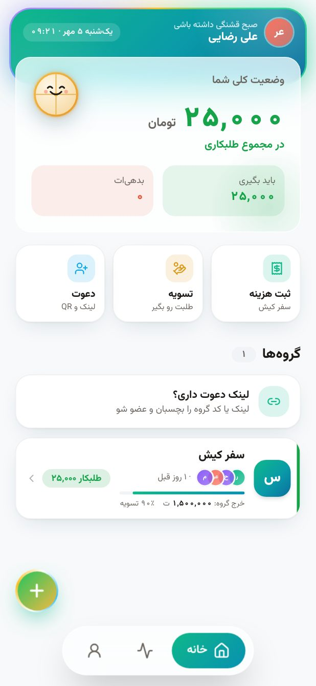
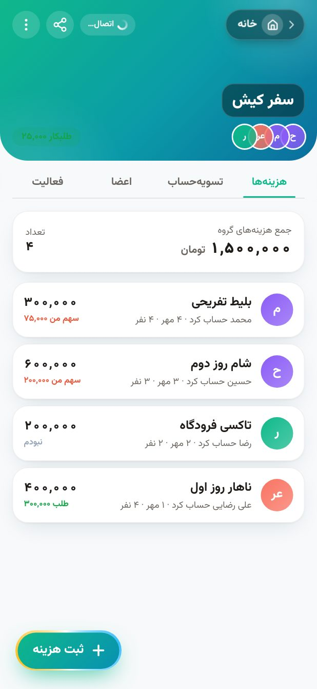
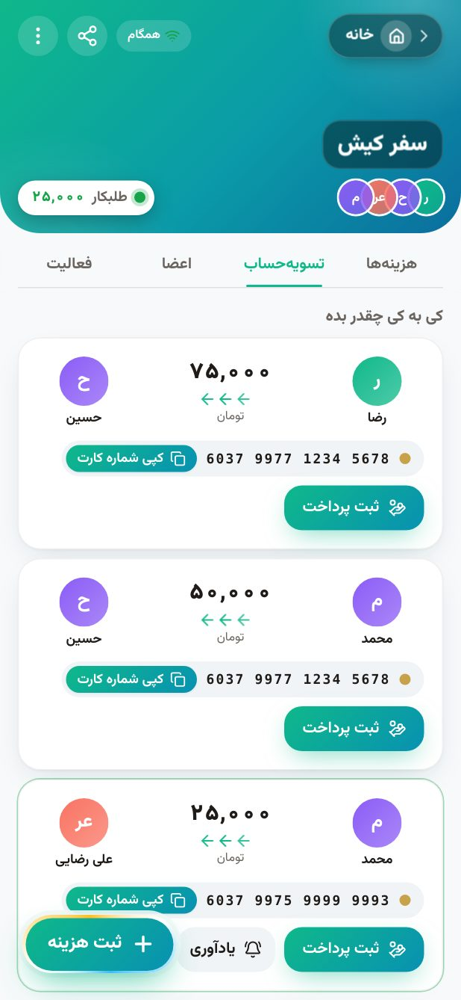
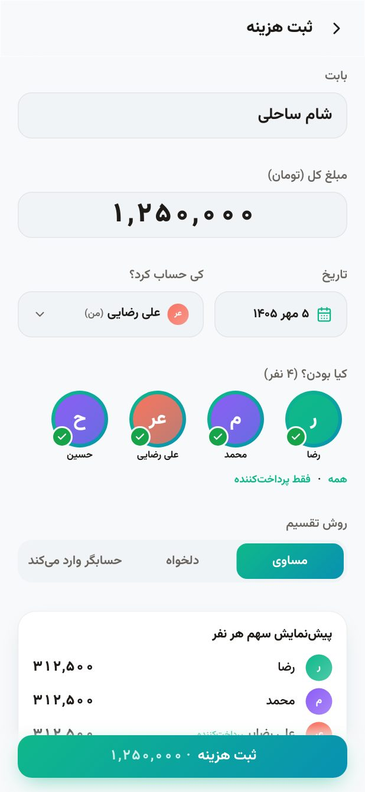
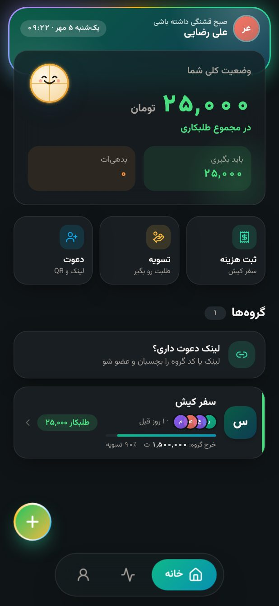

<div align="center">
  
  <h1>دُنگ — Dong</h1>
  <p><b>حساب‌کتاب مشترک، ساده و شفاف.</b><br/>اپلیکیشن تقسیم هزینهٔ گروهی برای سفر، خانهٔ مشترک و دورهمی‌ها.</p>
  <p>
    🌐 <a href="https://products.arounidea.com/dong/">نسخهٔ وب</a> ·
    📲 <a href="https://products.arounidea.com/dong/apk/">دانلود اپ اندروید</a> ·
    📖 <a href="https://products.arounidea.com/dong/guide/">راهنمای تصویری کاربر</a>
  </p>
</div>

<p align="center">
      
</p>

## چی کار می‌کند؟
در یک گروه، هر بار یکی حساب می‌کند و فقط بعضی‌ها حاضرند. دُنگ همهٔ این رفت‌وبرگشت‌ها را جمع می‌زند و آخرش با **کمترین تعداد تراکنش** می‌گوید *چه‌کسی دقیقاً به چه‌کسی چقدر بدهد*.

- ✅ موتور محاسباتی با اعداد صحیح (بدون خطای اعشار) + کمینه‌سازی تراکنش (Greedy) — ۶ تست الزامی سند فنی سبز
- ✅ شرکت‌کننده‌های متفاوت در هر هزینه؛ تقسیم مساوی / دلخواه / «حسابگر وارد می‌کند»؛ باقی‌مانده به پرداخت‌کننده
- ✅ ثبت پرداخت با رسید، پرداخت جزئی، تأیید / رد با دلیل، یادآوری، تاریخچهٔ کامل فعالیت
- ✅ شماره کارت بانکی با کپی یک‌ضربه‌ای و تشخیص بانک
- ✅ دعوت با لینک و QR، تقویم شمسی، RTL کامل، حالت تاریک به‌عنوان یک سیستم رنگ کامل، فونت وزیرمتن، ماسکوت
- ✅ آفلاین‌محور (IndexedDB) + همگام‌سازی بلادرنگ (PHP API + WebSocket) + اعلان‌ها

## مستندات
| سند | برای چه کسی |
|---|---|
| [📖 راهنمای کامل کاربر (تصویری)](docs-src/USER_GUIDE.md) — نسخهٔ وب: `/guide/` | کاربر نهایی |
| [🧭 راه‌اندازی کلیک‌به‌کلیک](docs-src/SETUP_CLICK_BY_CLICK.md) | صاحب محصول (بدون دانش فنی) |
| [🖥 هاست Plesk](docs-src/PLESK.md) · [⚡ Realtime](docs-src/REALTIME.md) · [🏠 Self-host](docs-src/SELF_HOST.md) | استقرار |
| [🛒 انتشار در Google Play](docs-src/PLAY_STORE.md) · [بستهٔ استور / بازار](store-assets/README.md) | انتشار |
| [سند فنی v2](docs-src/سند-فنی-اپلیکیشن-دنگ-v2.md) · [سند طراحی بصری](docs-src/سند-طراحی-بصری-دنگ.md) · [نقشهٔ راه](ROADMAP.md) | تیم توسعه |

## ساختار مخزن
```
apps/web            PWA (React + Vite + Tailwind + Framer Motion) + پروژهٔ اندروید (Capacitor, ir.dong.app)
apps/web/public     دارایی‌های استاتیک؛ guide/ = راهنمای تصویری کاربر
packages/core       ⭐ موتور بدهی + تست‌ها (مشترک وب/سرور)
api/                PHP API (منبع حقیقت روی هاست Plesk)
rt/                 هاب WebSocket (Cloudflare Worker + Durable Object)
store-assets/       آیکون، فیچر گرافیک، اسکرین‌شات‌های استور، متن‌های آماده
tools/              اسکریپت‌های تولید اسکرین‌شات، اسپلش، QA
.github/workflows   android.yml (APK/AAB) · plesk.yml (بیلد وب) · realtime.yml
```

## انتشار (خودکار)
- هر push روی شاخهٔ کاری → `plesk.yml` بیلد وب را در `deploy/dong` می‌گذارد و Plesk آن را روی `products.arounidea.com/dong` می‌کشد.
- `android.yml` فایل امضاشدهٔ `Dong-<نسخه>.apk` (+ `.aab` برای Play) را می‌سازد و روی برنچ `apk-release` می‌گذارد؛ Plesk آن را در `/dong/apk` منتشر می‌کند. اپ از `/apk/latest.json` نسخهٔ جدید را می‌فهمد.

## توسعه
```bash
npm ci
npm run dev -w @dong/web                       # وب
npx vitest run --root packages/core            # تست‌های موتور بدهی
VITE_BASE=/ VITE_PUBLIC_URL=https://products.arounidea.com/dong/ npm run build -w @dong/web
npm run shots        # اسکرین‌شات‌های استور   → store-assets/screenshots
npm run shots:docs   # اسکرین‌شات‌های راهنما   → apps/web/public/guide/img
node tools/docs/build-guide.mjs   # ساخت guide/index.html و docs-src/USER_GUIDE.md
```

## مثال محاسبه (از سند فنی)
علی ۳۰۰٬۰۰۰ برای ۳ نفر، رضا ۹۰٬۰۰۰ برای ۲ نفر (علی و رضا)، محمد ۶۰٬۰۰۰ برای ۲ نفر (رضا و محمد) →
خالص: علی ۱۵۵٬۰۰۰+، رضا ۸۵٬۰۰۰−، محمد ۷۰٬۰۰۰− → **۲ تراکنش**: رضا→علی ۸۵٬۰۰۰، محمد→علی ۷۰٬۰۰۰.

## مجوز
MIT
