# راهنمای کامل کاربر — دُنگ

> نسخهٔ آنلاین همین راهنما: https://products.arounidea.com/dong/guide/ · تصاویر با `npm run shots:docs` از خودِ اپ گرفته می‌شوند و با `node tools/docs/build-guide.mjs` این فایل و صفحهٔ وب دوباره ساخته می‌شوند.

## فهرست
- [🚀 شروع کار](#start)
- [👥 گروه‌ها](#groups)
- [🧾 ثبت هزینه](#expenses)
- [🤝 تسویه‌حساب](#settle)
- [🔗 دعوت و عضویت](#invite)
- [🔔 فعالیت‌ها و اعلان](#activity)
- [⚙️ پروفایل و تنظیمات](#profile)
- [❓ سؤال‌های رایج](#faq)

## 🚀 شروع کار

### صفحهٔ خوش‌آمد
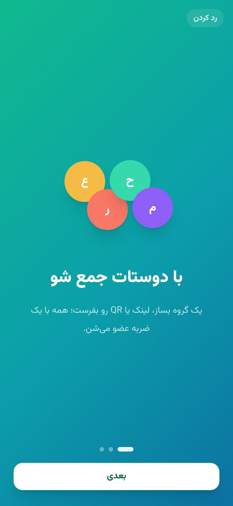

اولین بار که دُنگ را باز می‌کنی، سه اسلاید کوتاه ایدهٔ اپ را توضیح می‌دهد: گروه بساز، هزینه ثبت کن، با کمترین تراکنش تسویه کن. با «بعدی» جلو برو یا «رد کردن» را بزن.

 

### ساخت حساب
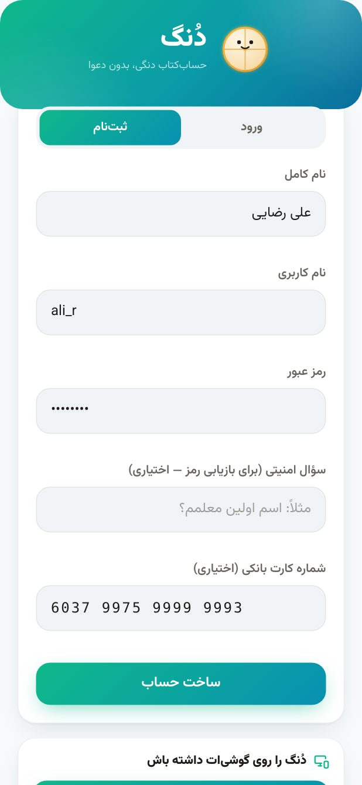

نام کامل، نام کاربری و رمز عبور را وارد کن. شماره کارت بانکی اختیاری است ولی اگر همین‌جا بنویسی، دوستانت موقع تسویه با یک ضربه شمارهٔ کارتت را کپی می‌کنند. شماره کارت باید دقیقاً ۱۶ رقم و معتبر باشد؛ اگر اشتباه باشد ذخیره نمی‌شود و پیام روشن می‌بینی.

- اگر قبلاً حساب داری، بالای فرم «ورود» را بزن.
- سؤال امنیتی اختیاری است و فقط برای بازیابی رمز به کار می‌رود.

 

### خانهٔ خالی
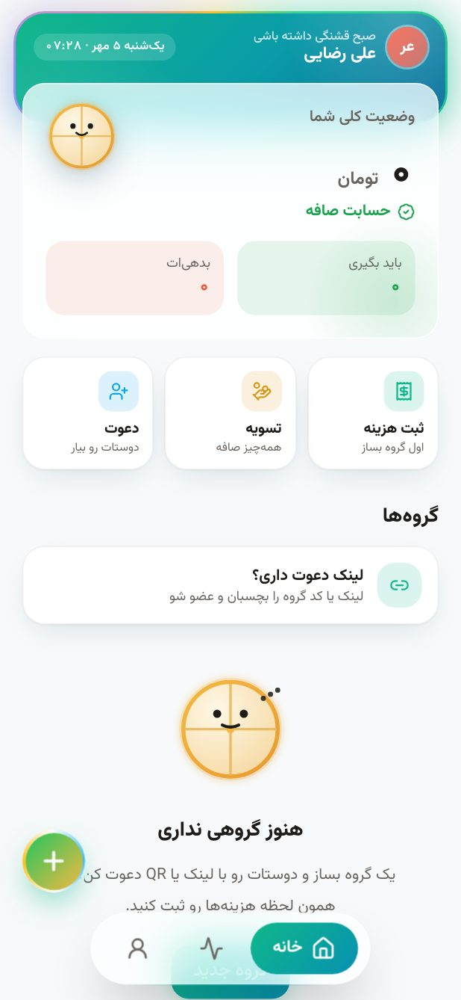

هنوز گروهی نداری. از دکمهٔ + یا کارت «ثبت هزینه/ساخت گروه» شروع کن، یا اگر کسی برایت لینک فرستاده «لینک دعوت داری؟» را بزن و لینک را بچسبان.

 

## 👥 گروه‌ها

### ساخت گروه
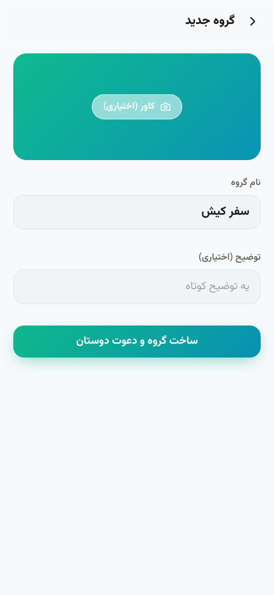

برای هر سفر، خانهٔ مشترک یا دورهمی یک گروه بساز. فقط یک نام کافی است؛ توضیح اختیاری است. بعد از ساخت، مستقیم به صفحهٔ دعوت می‌روی تا دوستانت را اضافه کنی.

 

### صفحهٔ خانه

بالای صفحه «وضعیت کلی شما» است: جمع طلب یا بدهی‌ات در همهٔ گروه‌ها با هم. ماسکوت دُنگ با حال‌وهوای حسابت تغییر می‌کند. زیر آن سه میان‌بر (ثبت هزینه، تسویه، دعوت) و فهرست گروه‌ها با درصد تسویه و وضعیت تو در هر گروه.

- نوار پایین: خانه، فعالیت‌ها، پروفایل.
- دکمهٔ + همیشه سریع‌ترین راه ثبت هزینه در آخرین گروه است.

 

### داخل گروه — تب هزینه‌ها

همهٔ هزینه‌های گروه با مبلغ، پرداخت‌کننده، تاریخ شمسی و سهم تو. بالای فهرست جمع کل خرج گروه را می‌بینی. روی هر هزینه بزن تا جزئیات یا ویرایش باز شود. فلش کنار «خانه» همیشه برت می‌گرداند به صفحهٔ اصلی.

- منوی سه‌نقطه: ویرایش نام گروه، خروج، حذف گروه (فقط سازنده).
- آیکون اشتراک: لینک دعوت را همان‌جا می‌فرستد.

 

### تب اعضا
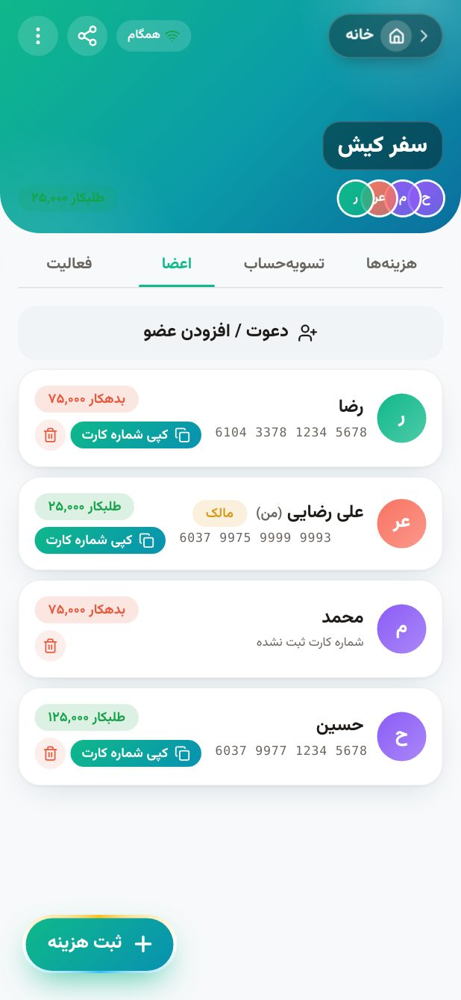

فهرست اعضا با وضعیت هر نفر (طلبکار/بدهکار/تسویه) و شماره کارتش. دکمهٔ «دعوت / افزودن عضو» بالای فهرست است. اگر دوستت هنوز اپ ندارد، می‌توانی او را به‌صورت «عضو بدون حساب» اضافه کنی و بعداً با لینک، حسابش را به همان نام وصل کند.

 

## 🧾 ثبت هزینه

### فرم هزینه

عنوان، مبلغ (به تومان، با جداکنندهٔ خودکار)، چه‌کسی حساب کرده، تاریخ و این‌که چه کسانی در این خرج شریک بوده‌اند. با روش «مساوی» سهم هر نفر همان لحظه پایین فرم نمایش داده می‌شود و باقی‌ماندهٔ تقسیم (مثلاً ۱ تومان) خودکار به پرداخت‌کننده می‌رسد تا جمع همیشه دقیق باشد.

- روی هر آواتار بزن تا از تقسیم حذف/اضافه شود.
- «فقط پرداخت‌کننده» یعنی خرج شخصی که فقط برای سابقه ثبت می‌شود.

 

### تقسیم دلخواه و «حسابگر وارد می‌کند»
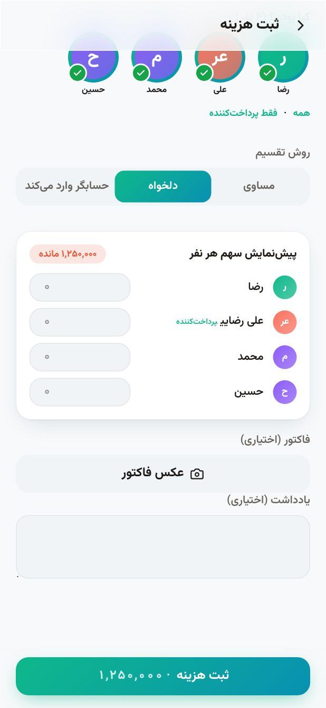

در حالت «دلخواه» مبلغ هر نفر را خودت می‌نویسی و دُنگ نشان می‌دهد چقدر تا جمع کل مانده؛ تا وقتی جمع درست نشود، دکمهٔ ثبت فعال نمی‌شود. حالت «حسابگر وارد می‌کند» برای وقتی است که کسی فاکتور را جدا کرده و سهم هر نفر را می‌داند. عکس فاکتور را هم می‌توانی ضمیمه کنی (خودکار فشرده می‌شود).

 

### ویرایش و حذف هزینه
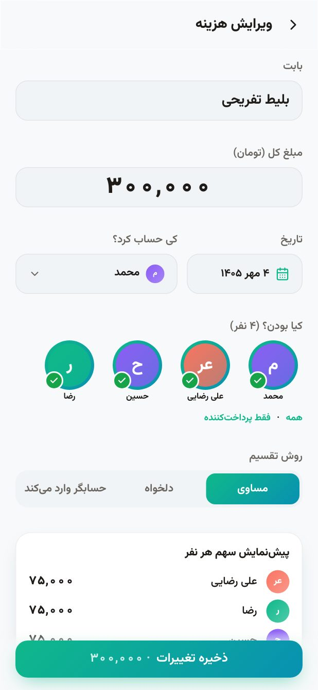

روی هزینه بزن؛ همان فرم با مقادیر قبلی باز می‌شود. هر تغییری در «فعالیت» گروه ثبت می‌شود تا همه شفاف ببینند چه کسی چه چیزی را عوض کرده.

 

## 🤝 تسویه‌حساب

### کی به کی چقدر بده؟

دُنگ همهٔ خرج‌های رفت‌وبرگشتی گروه را جمع می‌زند و با الگوریتم کمینه‌سازی، کمترین تعداد انتقال را پیشنهاد می‌دهد. برای هر انتقال، شماره کارت طلبکار با دکمهٔ «کپی شماره کارت» یک‌ضربه‌ای کپی می‌شود.

- پرداخت‌های در انتظار تأیید با نشان زرد بالای تب نمایش داده می‌شوند.
- «یادآوری» به بدهکار یک پیام آماده برای ارسال می‌دهد.

 

### ثبت پرداخت (کامل یا جزئی)
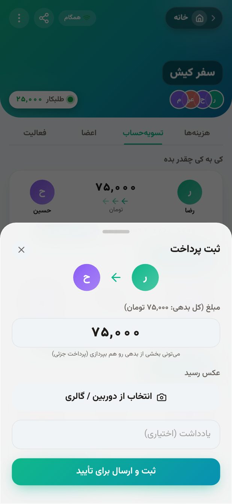

وقتی کارت‌به‌کارت کردی «ثبت پرداخت» را بزن. مبلغ پیش‌فرض کل بدهی است ولی می‌توانی کمتر بنویسی (پرداخت جزئی) و باقی‌مانده در فهرست می‌ماند. رسید و یادداشت اختیاری است. پرداخت با وضعیت «در انتظار تأیید» برای طلبکار می‌رود.

 

### تأیید یا رد پرداخت
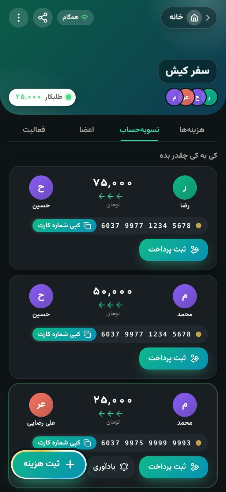

طلبکار پرداخت را می‌بیند و «تأیید» یا «رد با دلیل» می‌کند. با تأیید، بدهی بسته می‌شود و یک جشن کوچک نمایش داده می‌شود؛ با رد، پرداخت با دلیل به بدهکار برمی‌گردد و بدهی سر جایش می‌ماند. هر دو در فعالیت‌ها ثبت می‌شوند.

 

## 🔗 دعوت و عضویت

### دعوت با لینک یا QR
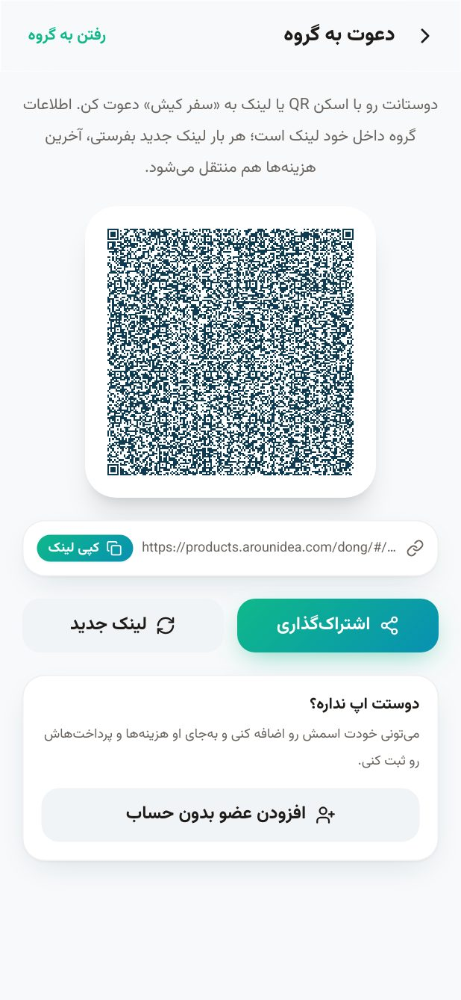

صفحهٔ دعوت هر گروه یک QR و یک لینک دارد. دوستانت با اسکن QR (دوربین گوشی کافی است) یا باز کردن لینک، مستقیم وارد همان گروه می‌شوند. اگر لینکی لو رفت، «لینک جدید» بساز تا قبلی باطل شود.

 

### عضو شدن با لینک
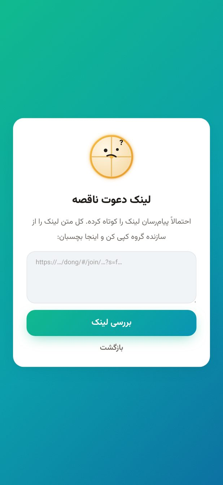

با باز کردن لینک، صفحهٔ «دعوت به گروه» را می‌بینی؛ اگر هنوز حساب نداری اول ثبت‌نام می‌کنی و بعد خودکار عضو می‌شوی. اگر لینک ناقص کپی شده باشد، همین‌جا می‌توانی آن را دستی بچسبانی و «بررسی لینک» بزنی.

 

## 🔔 فعالیت‌ها و اعلان

### فعالیت گروه
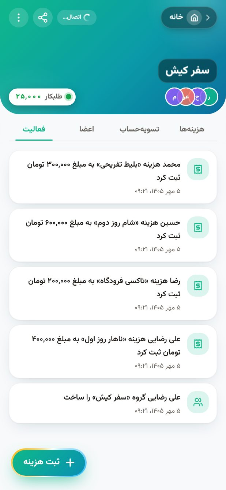

همهٔ اتفاقات گروه به ترتیب زمان: هزینهٔ جدید، ویرایش، پرداخت، تأیید/رد، عضو جدید. برای شفافیت، هیچ رویدادی قابل حذف نیست.

 

### فعالیت همهٔ گروه‌ها
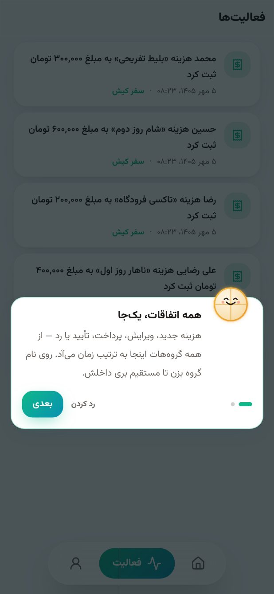

تب «فعالیت» در نوار پایین همهٔ گروه‌ها را یک‌جا نشان می‌دهد. بار اول یک راهنمای کوتاه می‌بینی. در نسخهٔ اندروید، رویدادهای مهم (پرداخت جدید، تأیید، یادآوری) به‌صورت اعلان هم می‌آیند.

 

## ⚙️ پروفایل و تنظیمات

### پروفایل
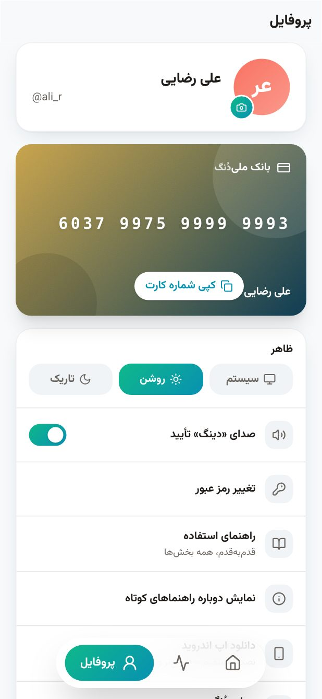

کارت بانکی‌ات را بالای صفحه می‌بینی؛ روی خودِ کارت بزن تا ویرایش شود. تم (روشن/تاریک/سیستم)، صدا و لرزش، تغییر رمز، راهنمای استفاده، دانلود اپ اندروید (در وب) یا «بررسی نسخه جدید» (در اپ) و خروج از حساب همه این‌جاست.

 

### ویرایش شماره کارت
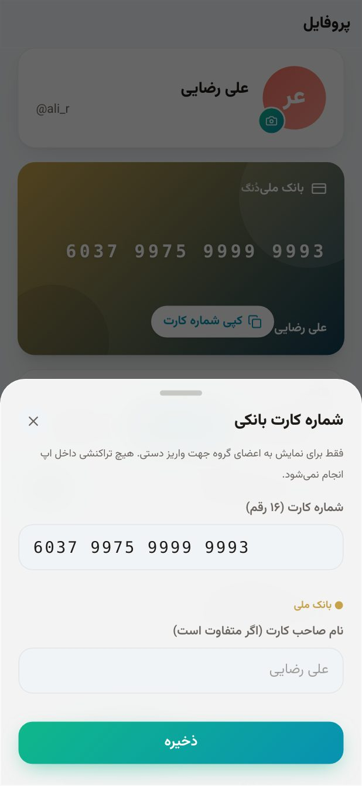

شماره ۱۶ رقمی را وارد کن؛ نام بانک از روی شماره خودکار تشخیص داده می‌شود. اگر نام روی کارت با نام حسابت فرق دارد، آن را هم بنویس تا دوستانت موقع واریز مطمئن باشند.

 

### راهنمای داخل اپ

همین راهنما به‌صورت خلاصه و بخش‌بندی‌شده داخل اپ هم هست (پروفایل ← راهنمای استفاده). راهنماهای کوتاه اول هر صفحه را هم می‌توانی از همین‌جا دوباره فعال کنی.

 

### حالت تاریک

دُنگ یک سیستم رنگ کامل برای حالت تاریک دارد؛ نه فقط پس‌زمینهٔ سیاه. با «سیستم» تم خودکار با تنظیم گوشی عوض می‌شود.

 

## ❓ سؤال‌های رایج

**اپ پول جابه‌جا می‌کند؟**  
نه. دُنگ فقط حساب‌کتاب می‌کند و می‌گوید چه‌کسی به چه‌کسی چقدر بدهد. پرداخت را خودتان کارت‌به‌کارت می‌کنید و در اپ «ثبت پرداخت» می‌زنید.

**اگر اینترنت نداشته باشم؟**  
همه‌چیز آفلاین کار می‌کند و روی گوشی ذخیره می‌شود؛ به محض وصل شدن، با اعضای گروه همگام می‌شود.

**چرا جمع سهم‌ها با مبلغ کل ۱ تومان فرق دارد؟**  
فرق ندارد؛ باقی‌ماندهٔ تقسیم (مثلاً ۱۰۰٬۰۰۱ تقسیم بر ۳) خودکار به پرداخت‌کننده اضافه می‌شود تا جمع دقیقاً برابر کل باشد.

**شماره کارتم را همه می‌بینند؟**  
فقط اعضای گروه‌هایی که در آن‌ها هستی، و فقط وقتی به تو بدهکار باشند برایشان نمایش داده می‌شود.

**چطور اپ را به‌روز کنم؟**  
در اپ: پروفایل ← «بررسی نسخه جدید». در وب: پروفایل ← «دانلود اپ اندروید» همیشه آخرین نسخه را می‌دهد. صفحهٔ دانلود: https://products.arounidea.com/dong/apk/

**حسابم را حذف کنم چه می‌شود؟**  
از پروفایل خارج شو؛ داده‌های محلی پاک می‌شوند. هزینه‌هایی که در گروه‌ها ثبت کرده‌ای برای شفافیت گروه باقی می‌مانند.

